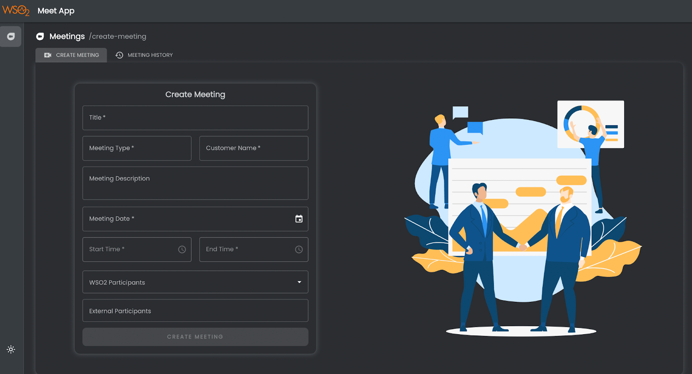
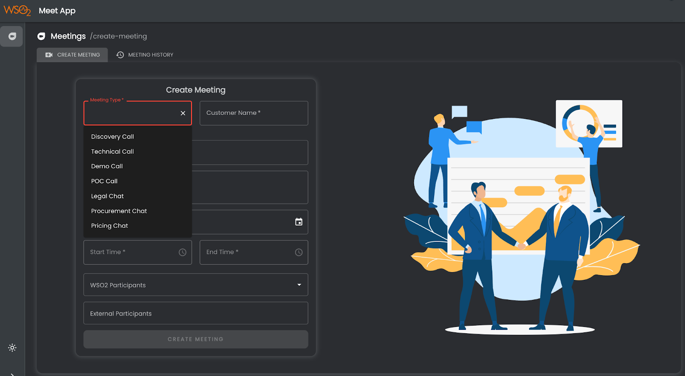
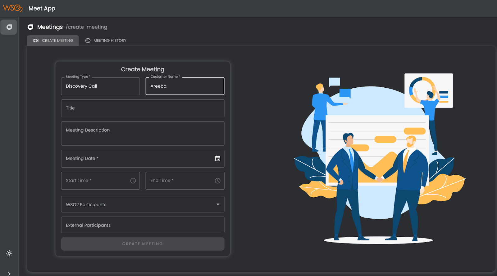
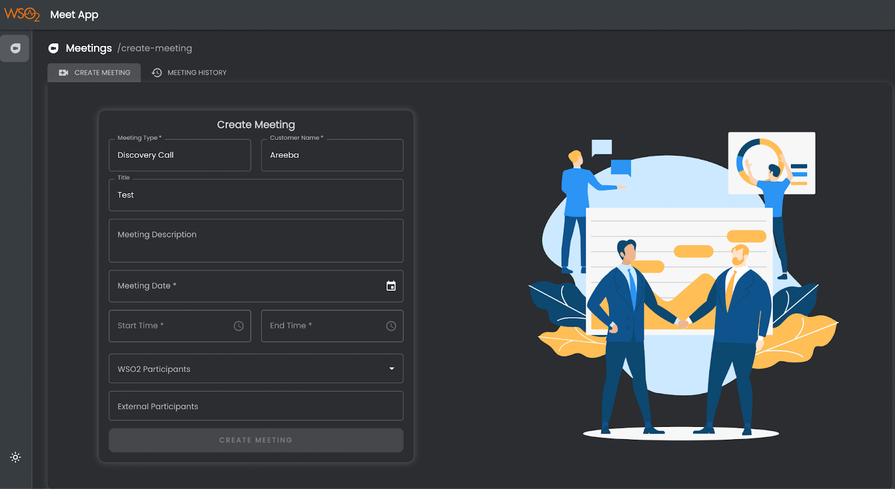
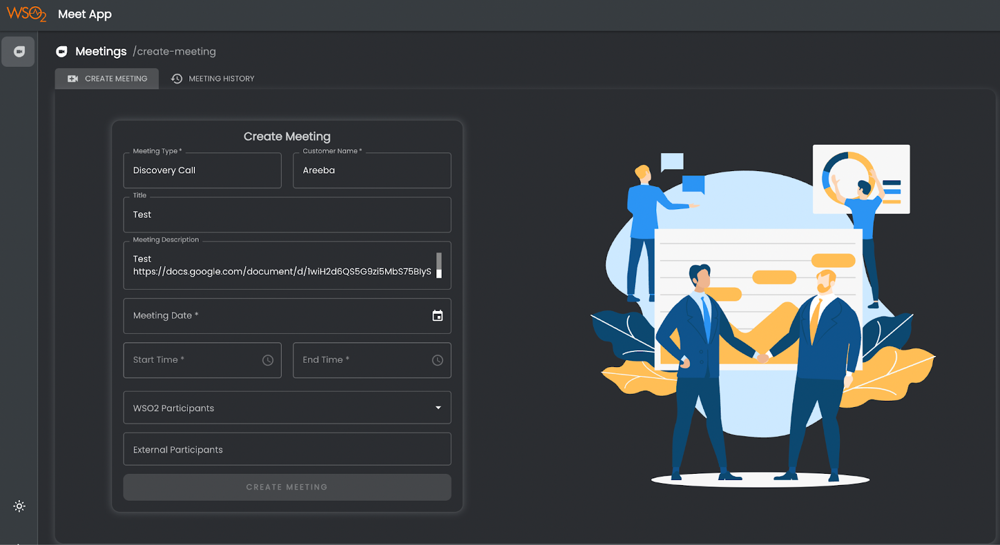
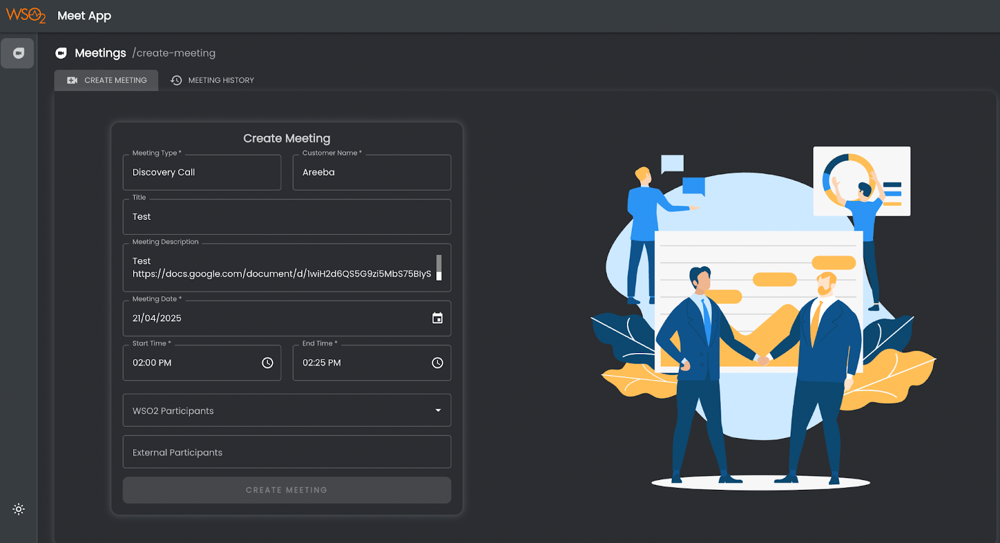
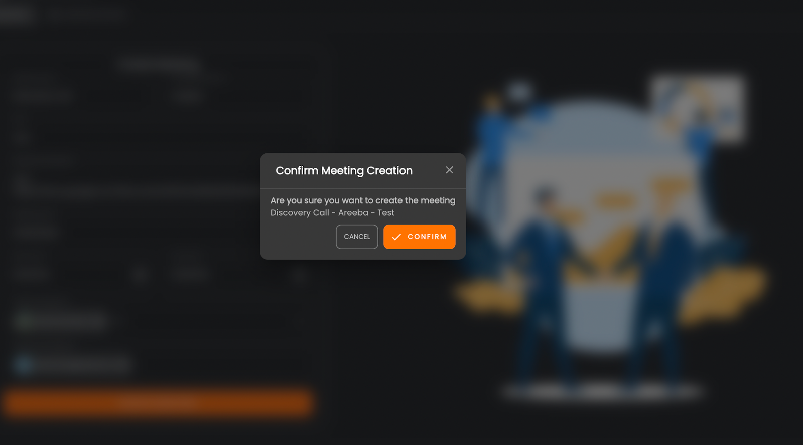
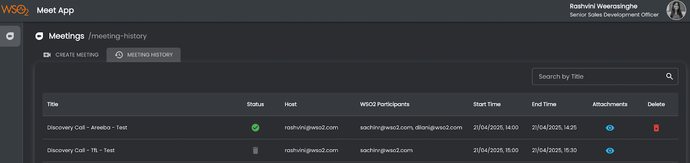

# **WSO2 Sales Meeting Scheduler User Guide**

 

## **Objective**

To centralize sales meeting recordings in a single location, enabling leads to provide feedback and ensuring that TOs and others who join the conversation later are up to date, thus maintaining continuity in discussions.

Currently, recordings are stored in the individual host's drive, making access inconvenient for others. Using a common user account to schedule sales meetings would ensure all recordings are stored in one shared drive. This would make it easier for leads to review calls and provide feedback, and for other team members (such as Solution Architects and Customer Success Managers) to catch up on previous discussions before joining.

 

## **WSO2 Sales Meeting Scheduler**

The <a href="https://meet.wso2.com" target="_blank">WSO2 Sales Meeting Scheduler</a> is a homegrown app created by the WSO2 DigiOps for the Sales Team. It was created to address the above issues and ensure that all sales call recordings are stored in a centralized location.

 

## **Creating a meeting**

Click the **Create Meeting** Tab on the top and;

1. Enter the **Meeting Type** - A pre-defined list of meeting types are available. The user has the ability to type a custom meeting name if required.

 

2. Enter the **Customer Name**.

 

3. The **Meeting Title** will be automatically generated based on the selected meeting type and the customer name entered.  
   The format will be: **Meeting Type - Customer Name - [Your Input in the Title Box]** (e.g., **Discovery Call - Areeba - Test**, as shown in the screenshot).  
   This helps maintain a consistent naming convention. You can use the Title box to add any additional details to be included, or leave it blank if you prefer.

 

4. **Meeting Description** - to add a description if needed. Links could be added as well.

 

5. Add the details of the **Meeting Date, Start Time** and **End Time**.

 

6. **WSO2 Participants** - Add the email address of the WSO2 team who'll be joining the call. You don't need to include your own name, as the organizer's details will be added to the invite automatically.

7. **External Participants** - Add the email addresses of the external participants.

8. Click **CREATE MEETING**. You'll get a pop-up to confirm the creation. Click **CONFIRM**.

 

9. Once scheduled, you will receive a Google Meet invite notification, just like you would when scheduling a meeting through Google Calendar. You can delete meetings from the **Meeting History** tab by clicking the **Delete Icon** next to the meeting entry.

 

## **Rescheduling Meetings**

Please make sure to use the **Google Calendar** meeting invitation to reschedule or modify the meeting.

 

## **Meeting History**

This tab is for viewing the meeting history. The **search bar** could be used to filter and find a specific call. The **Attachment** section would include the recording and transcript.

**Access permissions to view recordings**

The individual users (AMs, TOs, CMs) can view the recordings and transcripts of meetings they organized or participated in via the **Meeting History** tab of the app.

The admins including team leads and leadership would be able to access all the recordings via **[Google Drive](https://drive.google.com/drive/folders/1t4d4RIv1w1ULL8E5wgyd701oOP6TkFi8?usp=sharing)**

 

## **Additional Material**

- [WSO2 Sales Meeting Scheduler - Video Guide](https://drive.google.com/file/d/1QAQGC3w8C2HNvt30Lw0CIxgC4T4cClON/view)  
  (Video Guide - Walkthrough of the App and How to create a meeting)

- [Guidelines for Using Google Meets - Sales](https://docs.google.com/document/d/1amn8ICdOLAFtXnXgGd-tp3XpD2zoe2oN0IdLYEgNjUg/edit?usp=sharing)  
  (Includes details the Sales team must follow to obtain consent, store, and share call recordings externally)

- [Google Meets Enablement Session](https://pitstop-sales.wso2.com/sales-processes/tools/google-meets)

- [Pitstop Page](https://pitstop-sales.wso2.com/essential/wso2-sales-meeting-scheduler)

 

## **Support & Assistance**

For any inquiries or support needs, please reach out to the relevant team:
